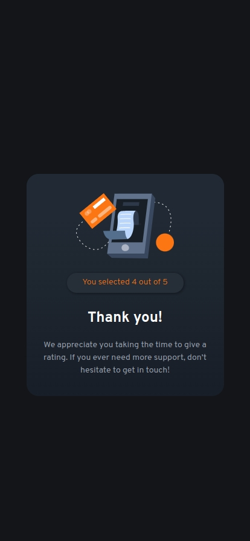
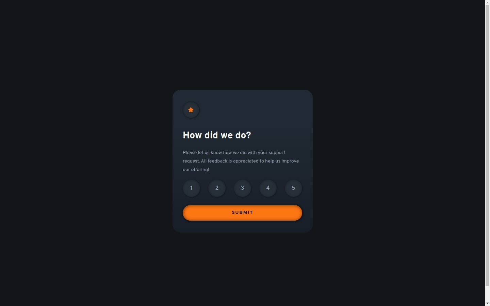
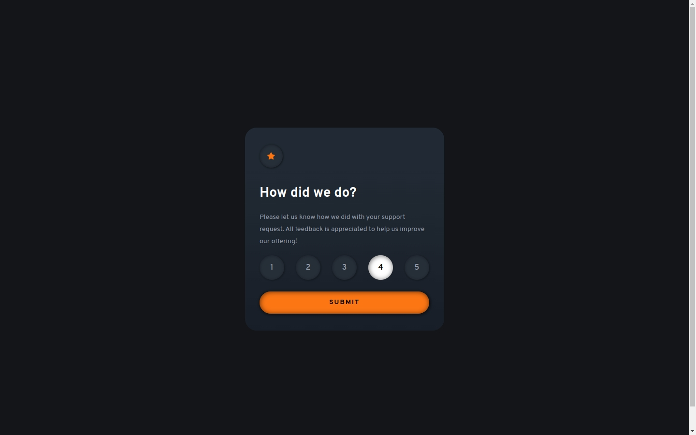

# Frontend Mentor - Interactive rating component solution

This is a solution to the [Interactive rating component challenge on Frontend Mentor](https://www.frontendmentor.io/challenges/interactive-rating-component-koxpeBUmI). Frontend Mentor challenges help you improve your coding skills by building realistic projects. 

## Table of contents

- [Overview](#overview)
  - [The challenge](#the-challenge)
  - [Screenshot](#screenshot)
  - [Links](#links)
- [My process](#my-process)
  - [Built with](#built-with)
  - [What I learned](#what-i-learned)
  - [Continued development](#continued-development)
  - [Useful resources](#useful-resources)
- [Author](#author)
- [Acknowledgments](#acknowledgments)

**Note: Delete this note and update the table of contents based on what sections you keep.**

## Overview

### The challenge

Users should be able to:

- View the optimal layout for the app depending on their device's screen size
- See hover states for all interactive elements on the page
- Select and submit a number rating
- See the "Thank you" card state after submitting a rating

### Screenshot

### Built with

- Semantic HTML5 markup
- CSS custom properties
- Flexbox
- CSS Grid
- Mobile-first workflow
- JavaScript 

### What I learned

*the use of the keyboard, which until now I had not paid attention to.*

  numberCheck.forEach((inputRadio, index) => {
        console.log('foreach: ', inputRadio, ' ', index); 
        inputRadio.addEventListener('keydown', function(e) {
            
            if (e.key === 'Tab' && !e.shiftkey) {
                console.log('TAB');
                if (index < numberCheck.length - 1) {
                    e.preventDefault();
                    numberCheck[index + 1].focus();
                console.log('TAB+focus');
                } 
            } else if (e.key === 'Tab' && e.shiftKey) {
                if (index > 0) {
                    e.preventDefault();
                    numberCheck[index - 1].focus();
                }
            } else if (e.key === 'ArrowRight' ) {

                e.preventDefault();
                const indexRight = (index + 1) % numberCheck.length;
                console.log('(index+1) % inputRadio.length: ', indexRight);
                numberCheck[indexRight].focus();

            } else if (e.key === 'ArrowLeft') {

                e.preventDefault();
                const indexLeft = (index - 1 + numberCheck.length) % numberCheck.length;
                console.log('index+1) % inputRadio.length: ', indexLeft);
                numberCheck[indexLeft].focus();

            } else if (e.key === 'Enter' || e.key === ' '){
                e.preventDefault();
                inputRadio.checked = true;
            } 
        });
    });

### Continued development

- Website - [Add your name here](https://www.your-site.com)
- Frontend Mentor - [@yourusername](https://www.frontendmentor.io/profile/yourusername)
- Twitter - [@yourusername](https://www.twitter.com/yourusername)

**Note: Delete this note and add/remove/edit lines above based on what links you'd like to share.**

## Acknowledgments

This is where you can give a hat tip to anyone who helped you out on this project. Perhaps you worked in a team or got some inspiration from someone else's solution. This is the perfect place to give them some credit.

**Note: Delete this note and edit this section's content as necessary. If you completed this challenge by yourself, feel free to delete this section entirely.**
